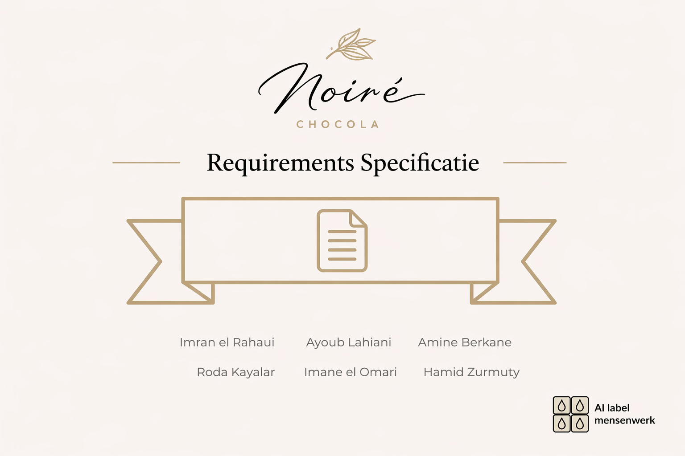

# Requirementsspecificatie
Dit is onze opdracht Requirements Specificatie. Deze opdracht gaat over het maken van een requirements specificatie voor een mobiele app van de Chocolate Firm. Deze app moet klanten helpen met het registreren van chocoladeproducten, het bekijken van productinformatie, het ontvangen van meldingen, het plaatsen van bestellingen, het indienen van klachten en het krijgen van persoonlijke aanbevelingen. Daarnaast bevat de app ook functies zoals een AI-chatbot, een community, event-inschrijvingen en winkelzoekers. In de opdracht beschrijven wij hoe het systeem werkt, wie de gebruikers zijn, hoe de processen nu en in de toekomst verlopen, en dit uitwerken in onder andere user stories, een sitemap en wireframes.
